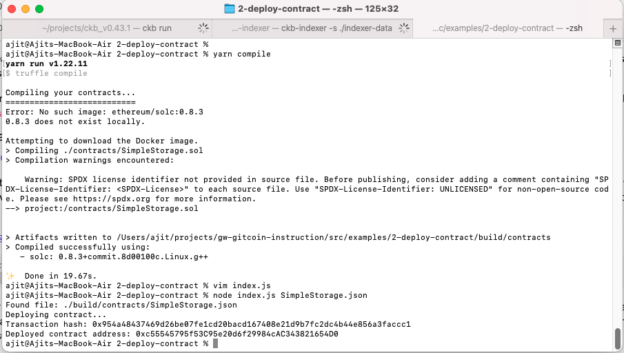

# Gitcoin: 2) Deploy A Simple Ethereum Smart Contract On Polyjuice

## 1. A screenshot of the console output immediately after you have successfully deployed a smart contract

## 2. The transaction hash from the contract deployment (in text format)

0x954a48437469d26be07fe1cd20bacd167408e21d9b7fc2dc4b44e856a3faccc1

## 3. The deployed contract address from the contract deployment (in text format)

0xc55545795f53C95e20d6f29984cAC343821654D0
