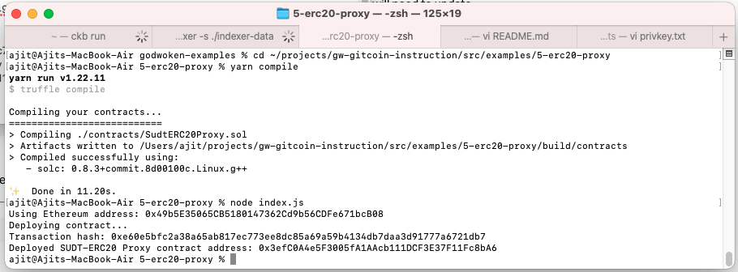
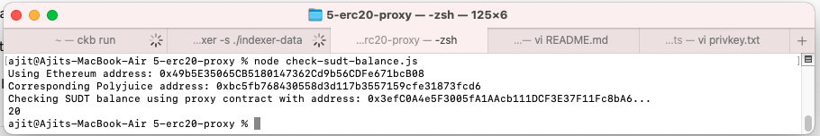

# Gitcoin: 5) Deploy The ERC20 Proxy Contract For The Deposited SUDT

## 1. A screenshot of the console output immediately after deploying smart contract.

## 2. The address of the ERC20 Proxy Contract you deployed (in text format).
0x3efC0A4e5F3005fA1AAcb111DCF3E37F11Fc8bA6

## 3. A screenshot of the console output immediately after checking your SUDT balance.

## 4. The Ethereum address that was checked (in text format).
 0x49b5E35065CB5180147362Cd9b56CDFe671bcB08
